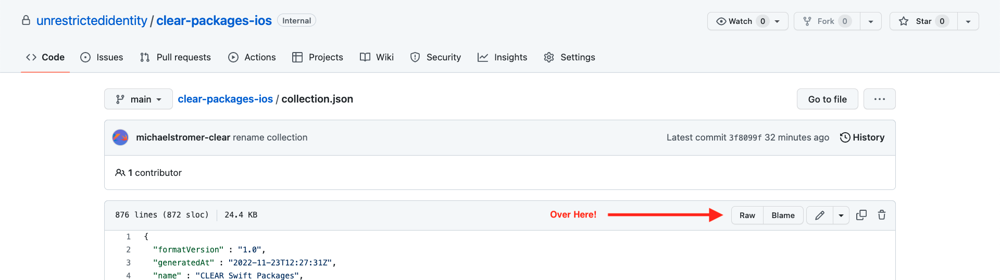
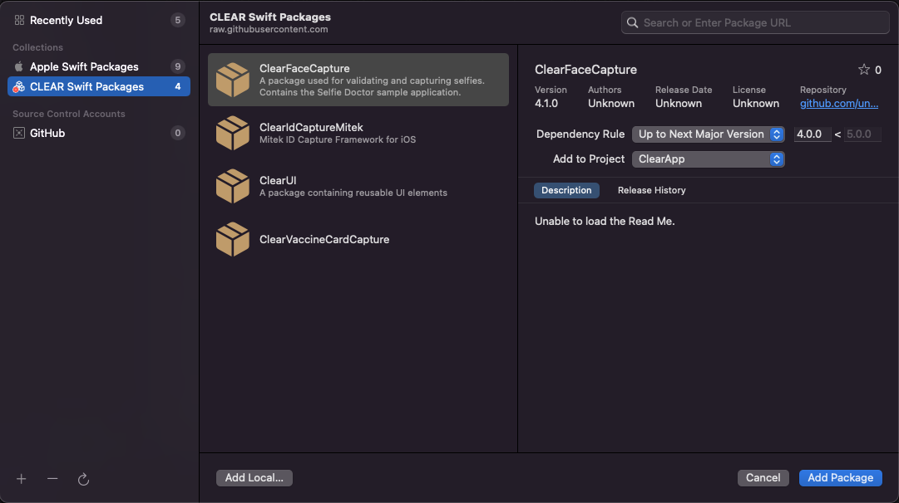

## Clear Swift Packages

A curated list of CLEAR Swift packages. 

### Introduction

Updating and tracking Swift Package versions across multiple repositories is quite cumbersome. With a Swift Package collection, we can keep track of internal packages updates within Xcode.

### Installation 

Visit the latest collection [here](./collection.json) and select **"Raw"** -- then copy the raw json file's URL from your web browser.



On the command line, `cd` into your swift project's repository and run the following:

```bash
swift package-collection add <packages-url> --trust-unsigned
```

Where `<packages-url>` is the URL you copied from the previous step.

If that worked, you should see the following output:

```bash
Added "CLEAR Swift Packages" to your package collections.
```

Success! 

Open Xcode, and you will be able to access the new Swift Package Collection:



Learn more about Swift Package Collections:
- https://theswiftdev.com/how-to-create-a-swift-package-collection/
- https://github.com/apple/swift-evolution/blob/main/proposals/0291-package-collections.md
- https://github.com/apple/swift-package-collection-generator
- https://developer.apple.com/videos/play/wwdc2021/10197/